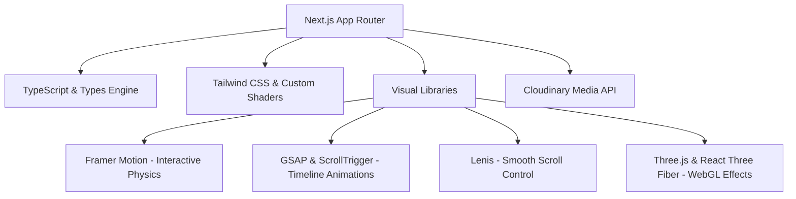

# BigTopSocial — Comprehensive Application Architecture & Page Blueprint

A full technical audit and blueprint of the **BigTopSocial** Next.js production codebase. This application represents a state-of-the-art interactive replica engineered for high-performance visual storytelling, combining advanced creative front-end math, dynamic 3D interactions, smooth momentum-scrolling, and a clean, programmatic component ecosystem.

---

## 1. Executive Technology Stack

The application is structured as a modern **Next.js (App Router)** site, utilising TypeScript and compiled with strict configuration standards.



### Core Technologies

- **Framework:** Next.js (App Router) with React 19 Support
- **Language:** TypeScript (Strict Typing Engine)
- **Styling:** Tailwind CSS (Custom visual utilities, custom glassmorphic overrides)
- **Animation Physics:** Framer Motion (v11/12) & GSAP (v3) with ScrollTrigger integration
- **Momentum Scrolling:** Lenis (v1.3)
- **3D / WebGL:** Three.js with React Three Fiber (`@react-three/fiber`)
- **Media Hosting & Processing:** Cloudinary (Dynamic video/image transformation API)

---

## 2. Directory & Architecture Map

The repository is modularised into a clear separation of routing, layout templates, reusable UI elements, content data stores, and backend API endpoints.

```
├── app/                          # NEXT.JS APP ROUTER CORE
│   ├── (site)/                   # Route Group (Shares common Header/Footer layout)
│   │   ├── about/                # /about Page (Team, Awards, Journey)
│   │   ├── blog/                 # Blog directory
│   │   │   ├── [slug]/           # Dynamic /blog/[slug] Article View
│   │   │   └── page.tsx          # /blog Index List Page
│   │   ├── blur-demo/            # Interactive Motion Lab / Demo Page
│   │   ├── contact/              # /contact Interactive Consultation Form Page
│   │   ├── privacy-policy/       # /privacy-policy Standard Page
│   │   ├── project/              # Case Studies directory
│   │   │   ├── [slug]/           # Dynamic /project/[slug] Case Study View
│   │   │   └── page.tsx          # /project Index Grid Page
│   │   ├── services/             # Services directory
│   │   │   └── [slug]/           # Dynamic /services/[slug] Detail View
│   │   ├── terms-conditions/     # /terms-conditions Standard Page
│   │   ├── layout.tsx            # Route Group Layout (Common Header/Footer & scrims)
│   │   ├── page.tsx              # Main Homepage Entry Route (Renders HomeSections)
│   │   └── template.tsx          # Dynamic Route Progressive Page Transition Wrapper
│   ├── api/                      # BACKEND ROUTE HANDLERS
│   │   └── cloudinary-reels/     # /api/cloudinary-reels (Cloudinary Video fetcher)
│   ├── globals.css               # Global Tailwind CSS overrides and animations
│   └── layout.tsx                # Root layout file (Fonts, Global Providers, Lenis Scroll)
│
├── components/                   # REUSABLE GRAPHIC & UI COMPONENTS
│   ├── blog/                     # Blog Specific Views
│   ├── faq/                      # FAQ Shared Accordions
│   ├── home/                     # Major Home-Specific Interactive Sections
│   │   ├── HomeSections.tsx      # Main Homepage Orchestrator (900+ lines of layout)
│   │   ├── HowWeWorkTimeline.tsx # IntersectionObserver-driven Sticky Process Timeline
│   │   ├── MobileContentReel.tsx # 3D Cylinder Drag-to-Rotate Mobile Showcase
│   │   ├── MobileTestimonials.tsx# Mobile Stacked Slider with "Show More" functionality
│   │   ├── PostStageSlider.tsx   # Desktop creations carousel
│   │   └── ReelsCarousel.tsx     # Desktop dynamic reels carousel
│   ├── layout/                   # Structural Frame Components
│   │   ├── Container.tsx         # Unified Horizontal Max-Width Grid Frame
│   │   ├── Footer.tsx            # Video-looping wordmark footer
│   │   ├── Header.tsx            # requestAnimationFrame hidden sticky header
│   │   ├── ProgressiveBlur.tsx   # Cumulative CSS mask backdrop blur system
│   │   └── SmoothScroll.tsx      # Lenis Smooth scroll and GSAP Ticker setup
│   ├── motion/                   # Custom Framer Motion Animators
│   │   ├── BlurTextReveal.tsx    # Smooth progressive word blur entrance
│   │   └── Reveal.tsx            # Viewport entrance wrapper
│   ├── project/                  # Case Study Detail Views
│   ├── services/                 # Service Offerings Detail Views
│   ├── ui/                       # Low-level visual primitives (Aceternity UI replica)
│   │   ├── canvas-reveal-effect.tsx # WebGL Dot Matrices & dynamic reveal grids
│   │   └── wobble-card.tsx       # Interactive 3D mouse tracking scale cards
│   ├── BorderGlow.jsx            # Mouse-coordinate edge light tracker
│   └── BorderGlow.css            # Stylesheet for relative glowing mouse borders
│
├── lib/                          # FUNCTIONAL UTILITIES & STATIC DATA
│   ├── content/                  # Static Data Stores (Separating Code from Copy)
│   │   ├── about.ts              # Team biographies, Awards, Industries lists
│   │   ├── blog.ts               # Core Blog Posts databases and structures
│   │   ├── faq.ts                # General FAQ accordion structures
│   │   ├── home.ts               # Pricing, process, testimonial structures
│   │   ├── projects.ts           # Case studies blocks and metadata
│   │   └── services.ts           # Service pages detail blocks and content arrays
│   ├── useMatchMedia.ts          # Custom Responsive Media Query Hook
│   └── utils.ts                  # Class merge utility (Alternative to clsx)
└── types/                        # TS Ambient Type Definitions
```

---

## 3. Site Navigation & Page Directory Blueprint

The application establishes a total of **11 public client routes** and **1 API endpoint**, utilizing Next.js static generation parameters (`generateStaticParams`) to guarantee lightning-fast server side delivery.

### Client Routes Breakdown

| Route Path          | Associated Code Entry                  | Static Gen (`SSG`) | Key Design Modules & Interactivity                                                                                                                                             |
| :------------------ | :------------------------------------- | :----------------- | :----------------------------------------------------------------------------------------------------------------------------------------------------------------------------- |
| `/`                 | `app/(site)/page.tsx`                  | Yes                | Custom 9x4 Organically Scattered Client Logo Grid, Video Hero Intro, Bento Portfolio Grid, Infinite Testimonial Marquees.                                                      |
| `/about`            | `app/(site)/about/page.tsx`            | Yes                | Background looping video, fluid layout, Team Grid, Awards Accolades timeline, and Industry categories display.                                                                 |
| `/blog`             | `app/(site)/blog/page.tsx`             | Yes                | Header video backdrop, high-contrast dynamic Category Tag filters, grid of editorial blog listing cards.                                                                       |
| `/blog/[slug]`      | `app/(site)/blog/[slug]/page.tsx`      | Dynamic SSG        | Dynamic path generation via `blogPosts` parameters. Connects to `BlogArticleView` displaying styled read times, tags, and articles.                                            |
| `/blur-demo`        | `app/(site)/blur-demo/page.tsx`        | Client Lab         | Interactive **Motion Lab** that exposes controls (stagger, duration, blur, Y-axis offset) to let designers preview `BlurTextReveal` live. Includes a Cloudinary video preview. |
| `/contact`          | `app/(site)/contact/page.tsx`          | Yes                | Multi-step interactive consultation booking system, glassmorphic inputs, inline error handlers.                                                                                |
| `/privacy-policy`   | `app/(site)/privacy-policy/page.tsx`   | Yes                | High-legibility typography layout using styled lists and containers.                                                                                                           |
| `/project`          | `app/(site)/project/page.tsx`          | Yes                | Complete grid list of brand case studies showcasing cover images, categories, and delivery years.                                                                              |
| `/project/[slug]`   | `app/(site)/project/[slug]/page.tsx`   | Dynamic SSG        | Dynamically pre-compiled. Mounts `CaseStudyView` with dynamic meta, statistics blocks (Services, Client, Year), and narrative content blocks.                                  |
| `/services/[slug]`  | `app/(site)/services/[slug]/page.tsx`  | Dynamic SSG        | Dynamically builds dedicated features for 6 services. Details specific methodologies, features, and links dynamic case studies.                                                |
| `/terms-conditions` | `app/(site)/terms-conditions/page.tsx` | Yes                | Core service agreement text utilizing uniform styling guides.                                                                                                                  |

---

## 4. Key Interactive Components & Creative Code Engineering

The wow factor of BigTopSocial is built on several custom-engineered interactive elements that combine math, viewport scrolling, and CSS filters:

### 1. BorderGlow Component (`components/BorderGlow.jsx`)

An advanced hover component that tracks client cursor coordinates inside the component's boundaries.

- **The Mathematics:**
  1.  Calculates **Edge Proximity** ($0.0 \rightarrow 1.0$) by dividing mouse distance from center by half-dimensions ($dx / cx$).
  2.  Calculates **Cursor Angle** ($0^\circ \rightarrow 360^\circ$) relative to center using `Math.atan2(dy, dx)` mapped to degrees.
- **The Render:** Updates CSS custom properties (`--edge-proximity` and `--cursor-angle`) dynamically on the DOM element in real-time. The matching `BorderGlow.css` uses these values inside conic and radial gradients, drawing a fluid neon border that revolves and lights up exactly where the mouse is close to the card edge.
- **Automated Sweep:** Triggers a mathematical easing automation (`easeInCubic`, `easeOutCubic`) on initial load to spin the glowing border $360^\circ$ as a premium loading cue.

### 2. MobileContentReel (`components/home/MobileContentReel.tsx`)

A mobile-specific, high-performance visual experience that solves standard boring layout constraints on small viewports.

- **The Mechanism:** Uses Framer Motion's `useMotionValue` and `useTransform` to map raw drag coordinates to a virtual **3D spatial cylinder**.
- **Visual Physics:** As the user drags horizontally, cards rotate along the Z-axis (`rotateZ: [-8deg -> 8deg]`), scale down dynamically, shift horizontally using a custom lateral array (`TX`), and dim automatically using a stacked black overlay opacity formula.
- **Immersive Playback:** Includes an Intersection handler. If the active slide contains a video, it triggers `.play()` only when resting near the center (`Math.abs(offset) < 0.45`), keeping other background videos paused to preserve mobile system resources.
- **Dynamic Lightbox:** Uses React Portals (`createPortal`) to lift media elements out of structural parents directly to `body` upon clicking, animating scaling entries alongside strict body scroll locks.

### 3. ProgressiveBlur (`components/layout/ProgressiveBlur.tsx`)

A luxury overlay bar pinned to the bottom of the viewport that dissolves scrolling page content into a progressive backdrop blur.

- **The Solution:** Standard single-layer backdrop blurs create ugly, harsh seams where the blur starts. ProgressiveBlur overcomes this via **Cumulative Masking**.
- **The Stack:** Stacks 7 absolute layers of `backdropFilter: blur(Npx)`.
- **The Math:** Each layer is fully solid at the bottom of the screen and fades to transparent at different vertical intervals (`stop: 25% -> 100%`) using overlapping CSS `linear-gradient` mask values.
- **Result:** A perfectly continuous, seam-free backdrop blur transition that reacts dynamically as elements slide underneath.

```
[Viewport Bottom]
 | Layer 1: 24px Blur  ============> Fades out at 25% height
 | Layer 2: 16px Blur  ==================> Fades out at 37.5% height
 | Layer 3: 10px Blur  =========================> Fades out at 50% height
 | Layer 4: 6px Blur   ===============================> Fades out at 62.5% height
 | Layer 5: 3px Blur   ======================================> Fades out at 75% height
 | Layer 6: 1.5px Blur ============================================> Fades out at 87.5% height
 | Layer 7: 0.5px Blur ==================================================> Fades out at 100%
[Page Content Scroll Area]
```

### 4. HowWeWorkTimeline (`components/home/HowWeWorkTimeline.tsx`)

A sticky interactive layout that acts as a visual timeline:

- **Visual Split:** Grid is divided into a left content column and a right graphic container.
- **Scroll Sync:** As the user scrolls vertically, an `IntersectionObserver` tracks which phase description is occupying the viewport center (threshold `0.55`).
- **Interactive Response:** Sets `activeIndex` which triggers absolute transitions on the right sticky container, changing opacity and scale (`scale(1.04) -> scale(1.0)`) on high-resolution mock screens to map to the user's reading position.

---

## 5. Design System & Aesthetics Architecture

The application strictly aligns with a high-end, dark-mode-first editorial style guidelines outlined in the codebase standards:

- **Color Palette:** Rich dark backdrops (`#000000`, custom dark-card greys) illuminated by a highly specific primary accent glow of **Teal / Sky** (`#12ced6` / `#38bdf8`) and an alternate green accent (`#40ffbb`).
- **Responsive Rhythm:** Major sections enforce a responsive spacing rhythm (`py-16 sm:py-20 lg:py-24`). Sections leading directly into full-bleed interactives use `pb-0` to eliminate visual gaps.
- **Glassmorphism:** Standardised via `border border-white/10`, background opacities ranging between `bg-white/[0.03]` and `bg-white/[0.045]`, and deep backdrop blur classes (`backdrop-blur-xl`).
- **Seeded Shuffle Logo Scatter:** The floating partner logo cloud on the home page uses a custom **Seeded Random Shuffle** algorithm based on the current calendar date (`Date.now() / 86400000`). This ensures that the layout rearranges itself dynamically once a day, but remains strictly identical and overlap-free during active user sessions.

---

## 6. Data Architecture (Model Separation)

All content copy is strictly isolated from presentation layers in `lib/content/`, allowing clean visual code updates without risking text regressions.

```typescript
// Example: The unified Project case study structure in lib/content/projects.ts
export type CaseBlock =
  | { type: 'paragraphs'; paragraphs: string[] }
  | { type: 'bullets'; title?: string; items: string[] };

export type Project = {
  slug: string;
  date: string;
  teaserTitle: string;
  teaserYear: string;
  title: string;
  subtitle: string;
  pills: string[];
  servicesLabel: string;
  servicesValue: string;
  categoryLabel: string;
  categoryValue: string;
  clientLabel: string;
  clientValue: string;
  liveHref: string;
  blocks: { heading: string; content: CaseBlock[] }[];
  moreCases: { title: string; slug: string }[];
  coverSrc: string;
  coverAlt: string;
};
```

---

## 7. Performance & Optimization System

To support dense media (high-res images, auto-looping background mp4s, interactive WebGL dots) at a constant **60 FPS**, the following engineering methodologies are built-in:

1.  **Hardware Accelerated Animations:** All transitions, rotators, and 3D transforms target GPU-friendly properties (`transform`, `scale`, `opacity`, `filter: blur`) rather than triggering page repaints (`width`, `height`, `top`).
2.  **requestAnimationFrame Throttled Headers:** Pinned sticky header scroll listening runs inside `window.requestAnimationFrame` utilizing a ticking flag. This prevents execution queues from locking the main thread during fast scrolling.
3.  **Media Stream Transformations:** Cloudinary video API urls are transformed via code (`secure_url.replace("/upload/", "/upload/q_auto,f_auto/")`) to deliver format-optimised, compressed WebM/MP4 assets automatically adjusted to user network capabilities.
4.  **Static Site Generation (SSG):** Dynamic slug routes contain strict `generateStaticParams` configs, creating pre-rendered HTML on build time to ensure zero delays during runtime navigation.
5.  **Smooth Scrolling Easing Integration:** Pinned Lenis scrolls feed custom tick rates directly into the GSAP ticker (`gsap.ticker.add((time) => lenis.raf(time * 1000))`), ensuring smooth ScrollTrigger timelines are in absolute sync.
